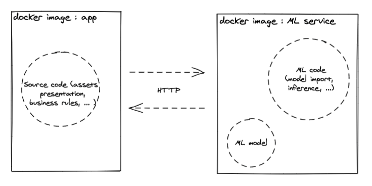
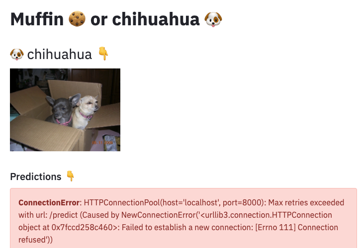
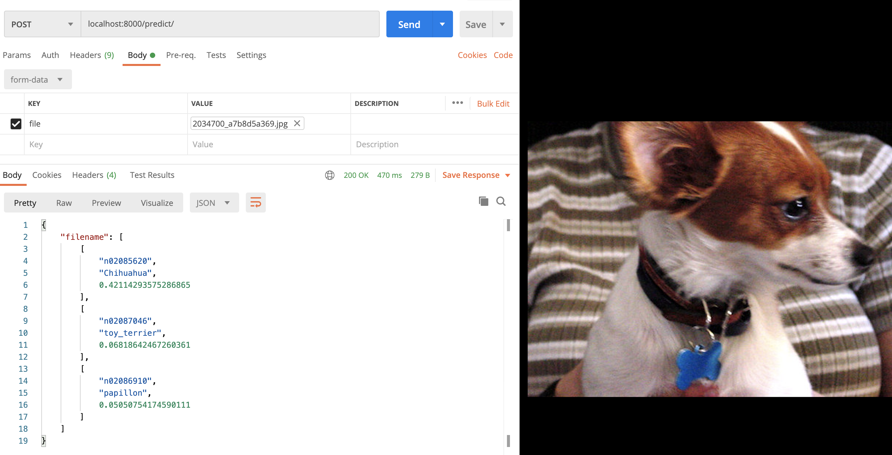

# muffin-v-chihuahua with a ML model exposed as a service 🍪 🐶

This repo offers some code to illustrate the following blog article <http://link to come when published>.

It aims to demonstrate one way to package with Wheel and Docker a Machine Learning application able to classify muffins and chihuahua in an image. 

This way is described as the packaging of an ML application with **"a model isolated as a separate service"** in the [Continuous Delivery for Machine Learning (CD4ML)](https://martinfowler.com/articles/cd4ml.html#ModelServing) article from Martin Fowler's blog. 


This app needs :

* a pre-trained Deep Learning model 🧠,
* some images of muffins 🍪 and chihuahuas 🐶, for demonstration purposes,
* some Python code 🐍.

Packaging of this Python app is done with :

* the Wheel format ☸️, with setuptools 
* and docker 🐳.

## Demo : run the muffin-v-chihuahua app with a model separated in an isolated service via docker-compose 🐳 ⚙

You can test the end result immediately with the following docker containers :

```bash
    $> docker pull mho7/muffin-v-chihuahua-frontend:v1;
    $> docker pull mho7/muffin-v-chihuahua-backend:v1;
```

You can then run `docker-compose up` to run these containers.

The frontend app is then available @ <http://localhost:8090>.

The remaining parts of this README document explains how to build these `muffin-v-chihuahua-frontend` and `muffin-v-chihuahua-backend` docker containers.

## Specificity of this approach (model isolated as a separate service)

This muffin-v-chihuahua classifier works with 2 services :

- one of them is a Streamlit frontend application, with the responsibility to expose images of muffins or chihuahua with their associated classification prediction

- the other one is a FastAPI backend application, with the responsibility to provide a muffin or chihuahua classification prediction when requested with a machine learning model.



Thus, the model is isolated from the "core" application, in a dedicated service.

## How to run the packaging of the frontend app

Basically, everything you can do regarding the frontend is available when running `cd frontend/ && make` or `cd frontend/ && make help` in your terminal, according to the [self-documented makefile](https://marmelab.com/blog/2016/02/29/auto-documented-makefile.html) convention.

### Download some images 🍪 🐶 ⬇️

You can run `make datasets` in the `frontend/` folder.

This command will populate the `muffin_v_chihuahua/data/chihuahua/` folder with a dataset of chihuahua images and `muffin_v_chihuahua/data/muffin/` with muffin images.

Those images are downloaded from <http://image-net.org/>.

### Package the application (with images and a model) as a Wheel 📦 ☸️

You can run `cd frontend/ && make package-wheel` to build a Wheel distribution from

* the [setup.py](./frontend/setup.py), [setup.cfg](./frontend/setup.cfg) and [MANIFEST.in](./frontend/MANIFEST.in) files,
* the Python sources in the [muffin_v_chihuahua](./frontend/muffin_v_chihuahua) package,
* the images of muffins and chihuahuas in [data/](./frontend/muffin_v_chihuahua/data) folder.

The result of this command will be the creation of a `dist/` folder containing the `*.whl` distribution.

### Package the application (with the Wheel) as a docker image 📦 🐳 

You can run `cd frontend/ && make package-docker` to build a docker image from

* the [dockerfile](./frontend/dockerfile) that describes the image,
* the [Wheel distribution](./frontend/dist/muffin_v_chihuahua_frontend-1.0-py3-none-any.whl) generated in the `dist/` folder

### Run the application as a docker container 🐳 ⚙

You can run the application with docker by running the following command : `make run-demo`.

While the application is running in your terminal, you can open your browser at <http://localhost:8090> to access the Streamlit frontend.

⚠️ As the frontend application has a strong dependency with the backend that is not up yet (we will address this issue in the remaining parts of this document), the frontend will display an error because it is not able to reach the ML web service at <http://localhost:8000>.



Let's fix this by building the backend ML web service and running it.

## How to run the packaging of the backend ML app

Basically, everything you can do regarding the backend is available when running `cd backend/ && make` or `cd backend/ && make help` in your terminal, according to the [self-documented makefile](https://marmelab.com/blog/2016/02/29/auto-documented-makefile.html) convention.

### Download a pre-trained model 🧠 ⬇

To avoid training an ad-hoc model for this computer vision task, we can download a pre-trained model with `cd backend && make model`.

This command will download the InceptionV3 model [listed on Keras website](https://keras.io/api/applications/).

This model is downloaded from François Chollet [deep-learning-models](https://github.com/fchollet/deep-learning-models/) repository, in which the official InceptionV3 model is exposed as an artefact in [release v0.5](https://github.com/fchollet/deep-learning-models/releases/tag/v0.5).

### Package the backend application (Python API + ML mode) as a docker image 📦 🐳 

You can run `cd backend && make package-docker` to build a docker image from the [dockerfile](./backend/dockerfile) that describes the image.

### Run the backend application as a docker container 🐳 ⚙

You can run the application with docker by running the following command : `cd backend && make run-demo`.

While the docker command is running in your terminal, you can open your browser at <http://localhost:8000/> to access the FastAPI Python API. This API exposes 2 routes :

- `http://localhost:8000/` is a healthcheck route returning HTTP 200 and `{STATUS : UP}` when the API is running.
- `http://localhost:8000/predict/`, via HTTP POST, expects an image file of a muffin or a chihuahua and returns a prediction. 

Here is an example of a prediction requested with Postman on an image of a chihuahua :



The API routes are described in [ml_web_service.py](./backend/muffin_v_chihuahua_ml_service/ml_web_service.py), and the API is requested by the frontend in [display_predictions_with_model_as_a_service.py.py](./frontend/muffin_v_chihuahua/display_predictions_with_model_as_a_service.py).
